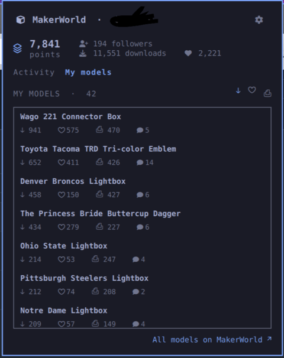

# MakerWorld for Omarchy

Your [MakerWorld](https://makerworld.com) (Bambu Lab) account in the Omarchy
bar and as desktop notifications — new comments and replies, likes, new
followers, system messages, design boosts, point changes, and boost-token
expiry.

- **Bar pill** — the MakerWorld cube mark, your point balance, and a filled
  unread badge. When something has arrived **since you last opened the popup**
  — new notifications, points up, or new followers — the mark and number turn
  your theme accent colour and a `▲` appears next to the balance; opening the
  popup clears the highlight (independent of MakerWorld's own read state). A
  warning triangle shows if the sign-in lapses.
- **Popup** — point balance, boost-token / follower / download / like counts,
  and two tabs:
  - **Activity** — unread-by-category chips, recent comments/replies/likes/etc.
    (click a row to open it on makerworld.com), "Mark all read".
  - **My models** — your published designs with per-model downloads, likes,
    prints and comments; sort by any of them, click through to the model.
  Plus a settings gear.
- **Notifications** — a headless service polls on an interval and raises an
  `omarchy-notification-send` notification for anything new; clicking it opens
  the relevant page. Includes:
  - comments, replies, likes, community likes, system announcements
  - **new followers** (from a change in your follower count)
  - **points up**, a **new boost token**, and a **boost token about to expire**
    (`boostExpiryWarnDays` before, using MakerWorld's own reminder)
  - **download / like milestones** — when your models pass a round total
    (250s early on, 1,000s in the thousands, 5,000s past 10k…)
- **Self-update** — the popup shows an Update button when a newer version is on
  GitHub; it runs `omarchy plugin update`.

The pill/popup and the notifier are one plugin; you can mount just the service
(no bar widget) if you only want notifications.

<p align="center"></p>

## Unofficial API — read this first

MakerWorld / Bambu Lab publish **no public API**. This plugin calls the same
`api.bambulab.com` endpoints the Bambu Handy mobile app uses, learned from
community reverse-engineering. Consequences:

- It can break whenever Bambu changes the app's backend. When a payload shape
  shifts, the fix is almost always one line in `Model.js` (all endpoints and
  parsers live there).
- You sign in with your real Bambu Cloud account. The access token is stored
  in `~/.config/omarchy/makerworld/token.json` (mode `600`).
- Polling is deliberately infrequent (default 5 min, floor 2 min) to stay
  courteous to an unofficial service.

**Sources:** [Doridian/OpenBambuAPI](https://github.com/Doridian/OpenBambuAPI/blob/main/cloud-makerworld.md),
[maziggy/bambuddy](https://github.com/maziggy/bambuddy),
[forum: public API for MakerWorld](https://forum.bambulab.com/t/public-api-for-makerworld/52699).

## Install

1. Install via the Omarchy plugin manager, or clone into
   `~/.config/omarchy/plugins/io.github.dreed47.makerworld/`.
2. **Get a token** (once) — pick whichever of the three below suits you.
3. `omarchy plugin enable io.github.dreed47.makerworld`
4. `omarchy-restart-shell`

There is no MakerWorld API key. Auth is your normal **Bambu Cloud account** —
the same login Bambu Handy and Bambu Studio use. Only the resulting token is
stored (`~/.config/omarchy/makerworld/token.json`, mode `600`); your password
is used for one request and never written anywhere.

All three commands below are in the plugin's `bin/` directory; adjust the path
if you cloned elsewhere.

### A. Import from Bambu Studio / Orca Slicer (no password)

```sh
bin/makerworld-login --from-slicer
```

If a signed-in slicer config is found, `makerworld-login` (with no arguments)
also offers this automatically. **Caveat:** current Bambu Studio / Orca builds
encrypt the cloud token on disk, so this often can't work — it will tell you
so and fall back to B or C. Older/native installs that keep the token in
plaintext do work.

### B. Log in with your Bambu account

```sh
bin/makerworld-login
```

Prompts for region, account, password, and — usually — a code Bambu emails
you. Authenticator (TFA) accounts are handled too. To script it:
`makerworld-login --account you@example.com --password-stdin < pwfile`.

### C. Paste a token from your browser

1. Sign in to <https://makerworld.com> in your browser.
2. Open dev tools → Network, reload, click any request to `api.bambulab.com`
   or `makerworld.com/api`.
3. Copy the value after `Bearer ` in the **Authorization** request header.
4. Run `bin/makerworld-token --paste` and paste it (add
   `--region china` for a `.cn` account).

This has no refresh token, so you'll repeat it whenever the token expires.

### Check it worked

```sh
bin/makerworld-token --check      # -> "token works - profile: <your name>"
```

## Updating

The popup shows an **Update** button when a newer version is on GitHub (checked
every `updateCheckHours`, default 12; set `checkForUpdates` off to disable).
The button runs `omarchy plugin update io.github.dreed47.makerworld` — after it
finishes, restart the shell to load the new code. Or run that command yourself.

## Removing

```sh
omarchy plugin disable io.github.dreed47.makerworld   # take it off the bar / stop the service
omarchy plugin remove io.github.dreed47.makerworld    # delete the plugin
rm -rf ~/.config/omarchy/makerworld                   # optional: drop the stored token + config
```

## Configuration

Two layers, highest priority first:

1. **The bar widget's settings** — the popup's gear, or `omarchy-bar set
   io.github.dreed47.makerworld <key> <value>`. Stored in `shell.json`.
2. **`~/.config/omarchy/makerworld/config.json`** — live-reloaded, used for any
   key the widget entry doesn't set (and the only option surface if you don't
   mount the bar widget). See `config.example.json`.

Both accept booleans and `"on"`/`"off"`.

| Key | Default | Meaning |
|---|---|---|
| `region` | `"global"` | `"global"` (api.bambulab.com) or `"china"` (api.bambulab.cn) |
| `pollSeconds` | `300` | unread-count poll interval; floored at 120 |
| `profileMinutes` | `15` | profile poll interval (points, followers, boost tokens, download / like totals); floored at 5 |
| `notify` | `on` | desktop notifications for new activity |
| `notifyTypes` | all | any of `comment`, `reply`, `like`, `follow`, `system`, `points` (or `"all"`). `follow` covers new-follower alerts; `points` covers points-up, new boost tokens, and boost-token expiry |
| `notifyTimeoutSeconds` | `0` | auto-dismiss after N seconds (0 = notification-daemon default) |
| `notifySound` | `""` | path to a sound file played on each notification (blank = silent) |
| `maxBurst` | `5` | cap notifications raised per poll, so a backlog can't flood you |
| `openOnClick` | `on` | clicking a notification runs `xdg-open` on the model/message URL |
| `showPoints` | `on` | show the point balance in the bar pill |
| `boostExpiryWarnDays` | `5` | warn this many days before a boost token expires (`0` = off; needs `points` in `notifyTypes` and a token in hand) |
| `notifyMilestones` | `on` | notify when your models pass a round download / like total |
| `checkForUpdates` | `on` | check GitHub for a newer plugin version and show an Update button in the popup (pings GitHub on a schedule; turn off to stop that) |
| `updateCheckHours` | `12` | hours between update checks (1–168) |
| `debug` | `off` | log raw API responses to the shell log to help adjust parsers |

## How it works

- `Service.qml` — headless. `Timer` → `curl` (via Quickshell `Process`) →
  parse → notify. First poll after start is adopted as a **silent baseline**,
  so enabling the plugin doesn't replay your existing unread backlog. Notified
  message IDs live in a bounded ring buffer in `PersistentProperties` so a
  shell reload doesn't re-notify. Publishes `points`, `followerCount`,
  `boostTokens`, `totalDownloads`, `totalLikes`, `unreadByType`, `unreadTotal`,
  `hasNew` / `newUnread` / `pointsDelta` (rise since the popup was last
  opened), `profileName`, `connState` for the pill/popup.
- Two poll loops: the fast one checks `/message/count`, and on a change pages
  only the affected notification category (comments / model activity / system
  / community — never print jobs). The slower one reads `/my/profile` for the
  point balance, follower count (a rise → "N new followers"), boost-token
  count, and lifetime download / like totals (a crossed round number → a
  milestone notification); when you hold a token it also scans system messages
  for MakerWorld's own expiry reminder and warns once per token.
- `BarWidget.qml` / `Panel.qml` — the pill and its popup. The Activity tab
  makes its own per-category `/my/messages` fetch (when opened, then every 2
  min); the My models tab lazily fetches `/design-service/my/design/published`
  the first time it's opened. Opening the popup calls `markSeen()` on the
  service, which clears the pill's "something new" highlight. The service owns
  polling and notifications.
- On HTTP 401/403 the service runs `bin/makerworld-refresh`. If that fails it
  raises one "sign-in expired — run `makerworld-login`" notification, shows a
  warning triangle on the pill, and waits for `token.json` to change.
- `Model.js` — all URLs, response parsing, message classification, config
  normalisation, and notify/seen bookkeeping. Pure functions, covered by
  `tests/`.

### CLI tools

| Tool | Purpose |
|---|---|
| `bin/makerworld-login` | one-time sign-in: `--from-slicer` (import), password login (default), or scripted with `--password-stdin` |
| `bin/makerworld-refresh` | non-interactive access-token refresh (run by the service) |
| `bin/makerworld-token` | `--status` (default), `--check`, `--path`, `--paste` |

### Manual poke (testing)

```sh
qs -p /usr/share/omarchy/shell ipc call makerworld status    # dump service state as JSON
qs -p /usr/share/omarchy/shell ipc call makerworld refresh   # poll now, keep the baseline
qs -p /usr/share/omarchy/shell ipc call makerworld poll      # re-baseline then poll now
qs -p /usr/share/omarchy/shell ipc call makerworld markRead  # mark all messages read
```

## Development

```sh
npm run check     # node --check + tests + py_compile + manifest validation
npm test          # Model.js unit tests only
```

Requires `python3` and `curl` (both ship with Omarchy).

## License

MIT © 2026 David Reed
